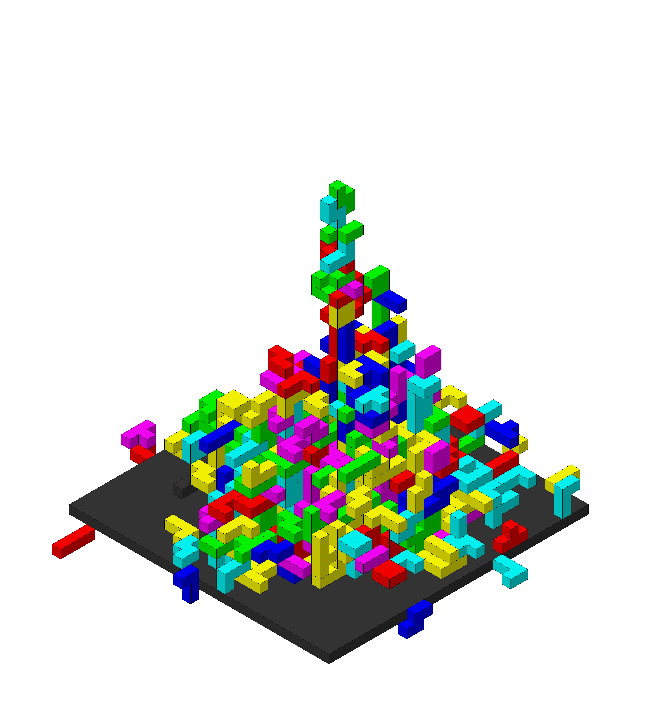

# Isometric Renderer

This project is a "from scratch" isometric renderer. It enables the user to generate 2D images of a 3D voxel world.

The inspiration for this side-project was a [reddit post](https://www.reddit.com/r/pics/comments/nuy0aq/a_fun_geometric_painting_ive_been_working_on/) of some geometric artwork, which I wanted to re-create and experiment with.

## Getting started

To generate images, in the simplist case import the IsometricRenderer and provide it with a file-path to export to and a dictionary of "cubes", where the keys are tuple co-ordinates for each cube, and the values are an integer cube type. These cube types are used to colour the cubes.

```python
from isometric_renderer import IsometricRenderer

cubes = {
    (0, 0, 0) : 0
}

ir = IsometricRenderer()
ir.render(cubes, "example.png")
```

The above example gives you this:

<div style="text-align:center">
    
</div>

The `IsometricRenderer` class has optional constructor arguments you can use to customise the renders generated. See the code for specifics however the key one is `cube_types` which is a list of filles where the index of each element corresponds to the `cube_type`.

```python
from isometric_renderer import IsometricRenderer

cube_types = [
    (255, 0, 0),
    (0, 255, 0),
    (0, 0, 255)
]

cubes = {
    (0, 0, 0) : 0,
    (1, 0, 0) : 1,
    (2, 0, 0) : 2
}

ir = IsometricRenderer(cube_types=cube_types)
ir.render(cubes, "example_2.png")
```

<div style="text-align:center">
    
</div>

Using these two options alone allows you to generate some quite different renders. 

<div style="text-align:center">
    
</div>

This pseduo-terrain was generated using perlin noise, and setting some constraints to determine whether the block type is rock, dirt, grass or water.

<div style="text-align:center">
    
</div>

Here is a pile of tetris pieces, created by randomly placing and rotating pieces in a normal distribution, then elevating them until they no longer collide with anything.

<div style="text-align:center">
    
</div>

Finally, here is a cut down version of the reddit piece I've reproduced. There's a few differences, and I haven't replicated all the special block types, however it satisfys what I wanted to get out of the exercise.

> Note: The reason I didn't replicate all the block types, is they required a higher sub-cube count. The current supported shapes mean my sub-cube count is 12x12x12 however I would have to increase to 15x15x15 which would greatly increase the render time. Given some renders already have well over 1 million triangles, increasing this so much wasn't worth the optimisation.

## Issues/Backlog
- Filtering of cube_types.
- Render Ideas:
    - Tetris bits, piled up. higher distribution towards back to create the "slant". Place bits in first free place up from bottom, rather than "dropping" to compress them.
    - Terrain where blocks change hue/shade organically via perlin noise. Looks like mineral deposits.
    - Terrain: Perlin noise xy to give z and seperate noise to give a hue.

## Licence

MIT